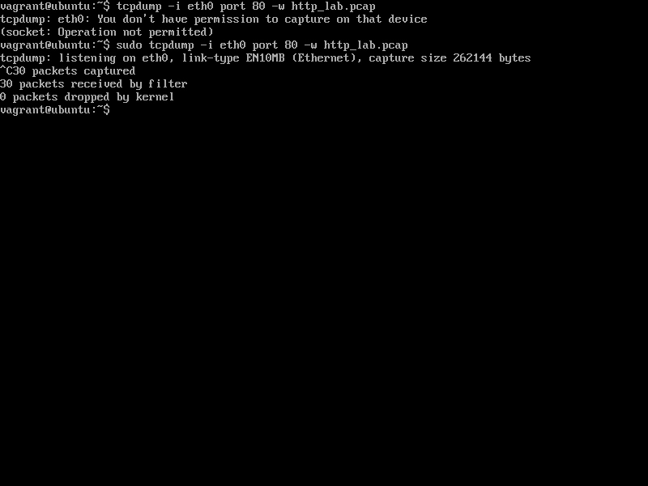
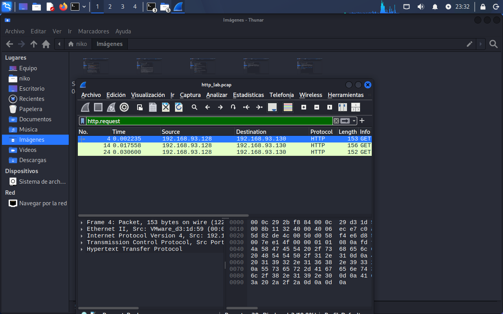
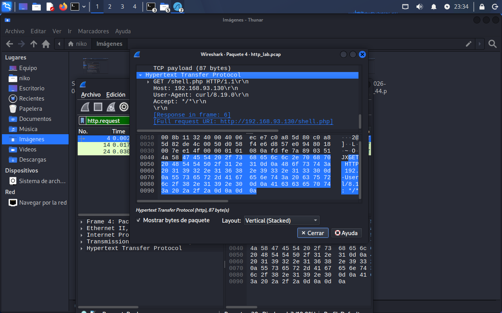

# HTTP Traffic Analysis - Suspicious Activity Detection

## Description (English)
In this lab, HTTP network traffic was analyzed to identify potentially suspicious activity on a web server.

## Descripción (Español)
En este laboratorio se analizó tráfico HTTP con el objetivo de identificar actividad potencialmente sospechosa en un servidor web.

---

## Scenario / Escenario

- Kali Linux → Traffic generation / Generación de tráfico  
- Metasploitable → Web server / Servidor web  
- tcpdump → Traffic capture / Captura de tráfico  
- Wireshark → Packet analysis / Análisis de paquetes  

---

## Methodology / Metodología

Traffic was captured using tcpdump:

tcpdump -i eth0 port 80 -w http_lab.pcap

### Traffic Capture (Metasploitable) / Captura de tráfico (Metasploitable)
HTTP traffic was captured directly on the target server.

Se realizó la captura del tráfico HTTP directamente en el servidor objetivo.

---

Then the capture was analyzed in Wireshark using the following filter:

http.request

### Wireshark Filtering / Filtrado en Wireshark
HTTP requests were filtered to identify client-server interactions.

Se filtraron las solicitudes HTTP para identificar la interacción entre cliente y servidor.

---

### Suspicious Request Identified / Solicitud sospechosa identificada

GET /shell.php HTTP/1.1

---

## Findings / Hallazgos

The request to `/shell.php` is considered suspicious.

Este tipo de endpoint suele estar asociado a:

- webshells  
- accesos no autorizados  
- mecanismos de persistencia  

---

## Interpretation / Interpretación

This behavior may indicate:

- Web exploitation attempts  
- Unauthorized access attempts  
- Reconnaissance activities  

Este comportamiento puede indicar:

- intentos de explotación web  
- intentos de acceso no autorizado  
- actividades de reconocimiento  

---

## Tools Used / Herramientas utilizadas

- tcpdump  
- Wireshark  
- curl  
- Linux  

---

## Conclusion / Conclusión

Network traffic analysis allows early detection of suspicious activity.

El análisis de tráfico de red permite detectar actividad sospechosa en etapas tempranas, siendo una tarea clave dentro de un SOC.
